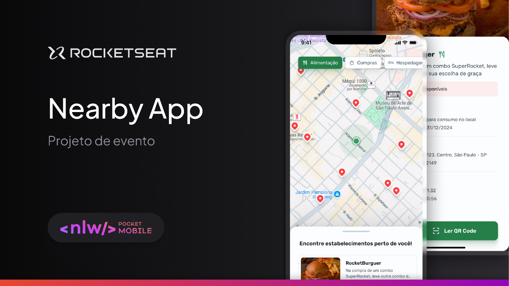

 <h1 align="center">Nearby - Clube de Benefícios<h1>

<p align="center">
  
</p>

## Descrição

Este é um aplicativo mobile de clube de benefícios que permite aos usuários resgatar cupons em estabelecimentos próximos a sua localização, oferecendo descontos e vantagens exclusivas. O app foi desenvolvido durante o evento gratuito da <a href="https://www.rocketseat.com.br/">Rocketseat</a>, a NLW Pocket Mobile, utilizando **Kotlin** e **Jetpack Compose** para a interface, além de integrar a **API do Google Maps** para localização e mapeamento de estabelecimentos.

### Funcionalidades:
- Cadastro de cupons de descontos.
- Localização de estabelecimentos próximos ao usuário com visualização no mapa.
- Resgate de cupons nos locais próximos, com detalhes sobre as ofertas.
- Integração com a API do Google Maps para exibir a localização e navegação.

---

## Tecnologias

- **Kotlin**: Linguagem de programação principal.
- **Jetpack Compose**: Biblioteca moderna para a construção de interfaces.
- **Google Maps API**: Utilizada para mostrar estabelecimentos próximos e realizar a navegação.
- **Figma**: Ferramenta utilizada para o design e prototipagem do aplicativo.

---

## Pré-requisitos

Para rodar o projeto localmente, você precisa dos seguintes requisitos:

- **Android Studio** (ou IDE compatível com Kotlin)
- **JDK 17**
- **Uma conta no Google Cloud** para configurar a API do Google Maps
- **Conexão com a internet** (para testes e uso de API)

---

## Instalação

1. Clone este repositório

```bash
git clone https://github.com/oliv-rocha/nearbyapp.git

```
2. Abra o projeto no Android Studio
Após o clone, abra o projeto no Android Studio.

3. Configuração da API do Google Maps
Para usar a API do Google Maps, siga os seguintes passos:

Crie um novo projeto no Google Cloud Console.

Habilite a API do Google Maps.

Gere uma chave da API (API Key) e coloque-a no arquivo local.properties na raiz do seu projeto:

```bash
google_maps_api_key=YOUR_API_KEY

```
4. Após configurar as chaves da API, sincronize o Gradle para garantir que as dependências estejam atualizadas.

```bash
Sync Now

```
5. Agora você pode executar o projeto em um dispositivo Android ou em um emulador.


## Licença

Este projeto está licenciado sob a <a href="https://mit-license.org/">licença MIT</a>

## Agradecimentos
Agradeço à <a href="https://www.rocketseat.com.br/">Rocketseat</a> pela oportunidade de participar da NLW Pocket Mobile e a todos que colaboraram no desenvolvimento deste projeto!